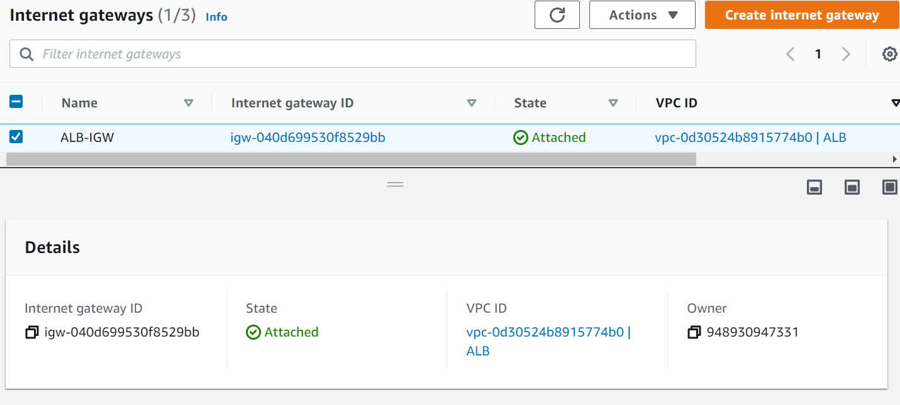
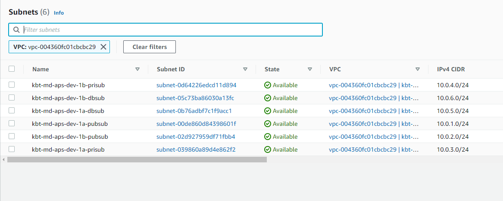
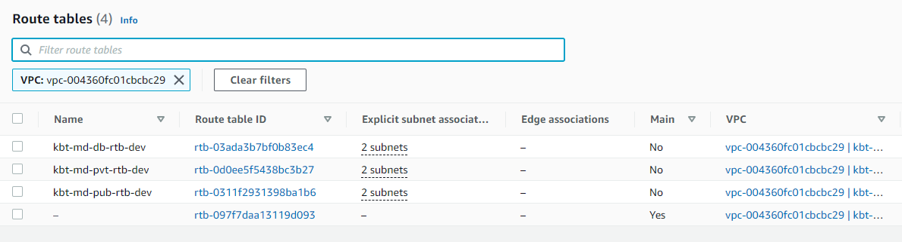
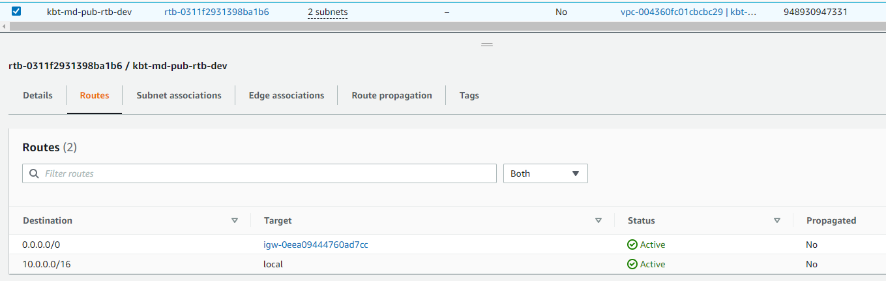
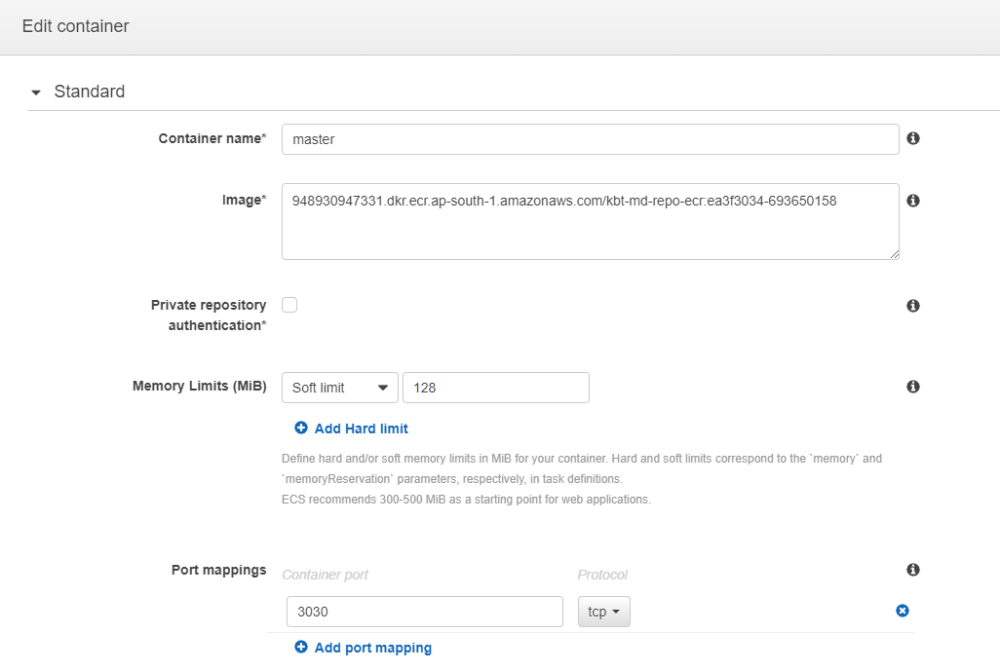
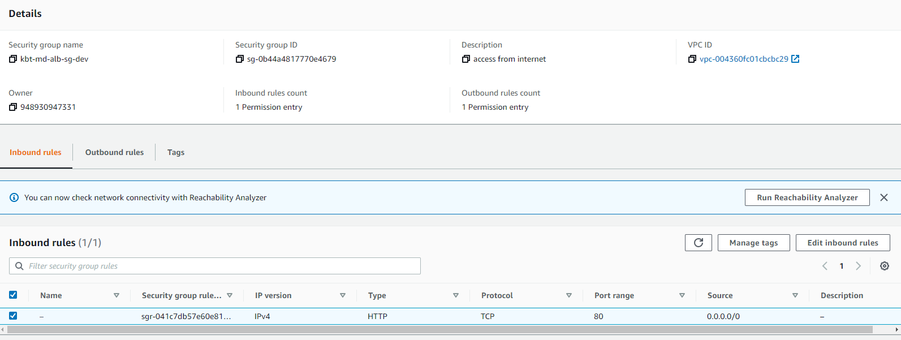
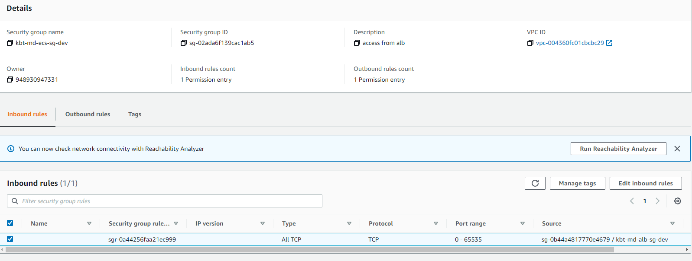
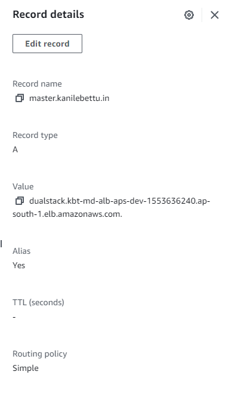
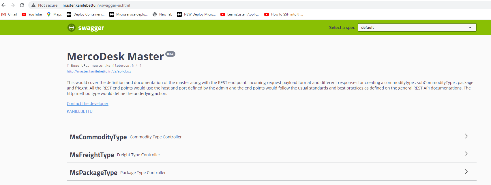

*Deployment of master microservice with RDS postgre database instance onto ECS Fargate & access via Load balancer & Route 53* +

==== STEP 1

_From the Gitlab, with the help of CI/CD pipeline the code is build(jar file is created) and tested.
The artifacts folder will be created while building and jar file is saved inside the target folder on local repository._ +

//image::jarfile.png[title=jarfile,align="center",width=500]

---

==== STEP 2

_With the help of Dockerfile, the jar file is executed._ +

image::../../../pages/images/dockerfile.png[title=dockerfile,align="center",width=500]

---

==== STEP 3

_Gitlab login to AWS console using gitlab-ci.yaml file , through credentials provided in the variables section of CI/CD under Settings._ +

image::../../../pages/images/gitlab cred.png[title=gitlab variables,align="center",width=500]

---

==== STEP 4

_The docker image is build, tagged & directly pushed to ECR repository named kbt-md-repo-ecr using ci/cd pipeline._ +

//image::images/ecr.png[title=ECR repository,align="center",width=500]

---

==== STEP 5

_Created a VPC named kbt-md-vpc-aps-dev with CIDR block 10.10.0.0/16_ +

_Created an Internet Gateway kbt-md-igw-aps-dev and attach it to VPC created._ +

---

==== STEP 6

_Created 6 subnets , 2 public subnet for Web ,2 private subnet for App and 2 private subnet for Postgres database._ +

---

==== STEP 7

_Created a Route table for both private and public subnet._ +

---

==== STEP 8

_Associate the subnets created with private subnets to private-RT and public subnets to public-RT._ +

_Edit public subnet route by attach it to internet gateway_

---

==== STEP 9

_Created a NAT gateway and associate it with Elastic IP._

_Edit private subnet route by attach it to NAT gateway_

//image::images/pubrtb.png[title=subnet association,align="center",width=500]

---

==== STEP 10

_Amazon ECS is a fully managed container orchestration service that helps you easily deploy, manage, and scale containerized applications._

_Created a cluster named kbt-md-master-cluster._  +

//image::images/cluster.png[title=cluster creation,align="center",width=500]

---

==== STEP 11

_Created a task definition named kbt-md-master-task by adding the container using image uri of repository and specify the port 3030._ +

---

==== STEP 12

_An Application load balancer is created within our VPC having internet facing scheme._  +

image::images/lb.png[title=Load balancer creation,align="center",width=500]

---

==== STEP 13

_Created Application Load balancer resides in the public subnet and The ALB is listening the port HTTP - 80_ +

_ALB follows the security group as,_ +

---

==== STEP 14

_The target group for load balancer is created with target type: IP and port as HTTP - 3030._ +

---

==== STEP 15

_The service is created  with a name kbt-md-master-service , for task to run and maintain a specified number of instances of a task definition simultaneously in an Amazon ECS cluster._ +

_Note: If one of your tasks fails or stops, the Amazon ECS service launches another instance of your task definition to replace it._ +

//image::images/service.png[title=service creation,align="center",width=500]

---

==== STEP 16

_Attach the created load balancer with the ECS service & specify the security group as mentioned._ +

---

==== STEP 17

_Go to Route 53 -> click on hosted zones -> select kanilebettu.in -> click on create record_ +

---

==== STEP 18

_Now the service is hosted on master.kanilebettu.in_ +

